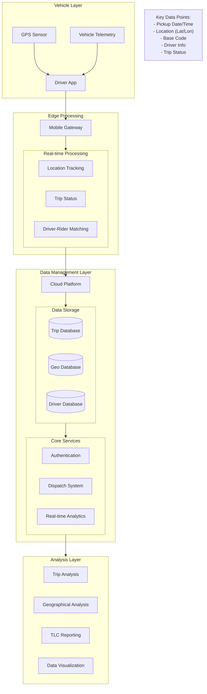

## **Uber Trip Time Series Analysis**

## **Authors:**
1. Suman Senapati
2. Koelgeet Kaur
3. Dr. Sanjay Kumar

## **Overview**

This comprehensive dataset provides detailed information about ride-hailing services in New York City, with a primary focus on Uber operations during 2014-2015. The data was obtained through Freedom of Information Law (FOIL) requests submitted by FiveThirtyEight to the NYC Taxi & Limousine Commission (TLC) in July 2015.

## **Dataset Source:**
source: https://github.com/fivethirtyeight/uber-tlc-foil-response

## **Dataset Scope**

#### Uber Pickups: Over 18.8 million records
4.5+ million pickups (April-September 2014)
14.3+ million pickups (January-June 2015)
Additional FHV Data:
Individual trip data from 10 for-hire vehicle companies
Aggregated data covering 329 FHV companies
#### Research Impact
The dataset has been instrumental in several significant FiveThirtyEight investigations:

Analysis of Uber's service coverage in NYC's outer boroughs compared to traditional taxis
Examination of the relationship between public transit and ride-hailing services
Assessment of Uber's impact on Manhattan's traditional taxi market
Investigation into Uber's effect on NYC rush-hour traffic patterns

## **Data Structure**

2014 Uber Data (April-September)
Files are organized monthly with the following columns:

Date/Time: Pickup timestamp
Lat: Pickup latitude
Lon: Pickup longitude
Base: TLC base company code
2015 Uber Data (January-June)
Contains enhanced data fields:

Dispatching_base_num: TLC base company dispatch code
Pickup_date: Pickup timestamp
Affiliated_base_num: TLC base company affiliation code
locationID: Standardized pickup location identifier
Base Code Reference
Uber operates through multiple bases in NYC, each with a unique identifier:

B02512: Unter
B02598: Hinter
B02617: Weiter
B02682: Schmecken
B02764: Danach-NY
B02765: Grun
B02835: Dreist
B02836: Drinnen
Supplementary Data
FHV Company Data
The dataset includes:

Detailed trip records from 10 FHV companies
Daily pickup aggregates for 329 FHV companies (January-August 2015)
Variable fields including:
Trip date and time
Pickup locations
Driver license numbers
Vehicle license numbers
Reference Files
taxi-zone-lookup.csv: Maps locationIDs to specific zones and boroughs
Aggregate_FHV_Data.xlsx: TLC's analysis of taxi and FHV trips
Uber-Jan-Feb-FOIL.csv: Daily aggregated Uber statistics (January-February 2015)
TLC correspondence: Documentation of the FOIL request process (TLC_letter.pdf series)
Data Collection Context
The data was released in multiple batches throughout 2015 as the TLC reviewed and processed the records. This systematic release ensures comprehensive coverage while maintaining data quality standards. The inclusion of TLC correspondence provides transparency regarding the data collection process and any potential limitations or considerations in the dataset.

## **Technical Notes**
Location data is provided in two formats:
Direct geographical coordinates (2014 data)
LocationID reference system (2015 data)
Base codes serve as important identifiers for tracking operational patterns
The dataset structure evolved from 2014 to 2015, reflecting enhanced data collection practices
This dataset represents a significant resource for understanding the evolution of ride-hailing services in New York City and their impact on urban transportation patterns during a critical growth period.

Based on the dataset we are working on, we may look at the following goals/objectives:

1. Ride Demand Prediction
Goal: Predict the number of Uber pickups at a given time and location.
Input Features:
Date & Time (hour, day, month, weekday/weekend)
Location (Latitude & Longitude or Zone ID)
Output: Expected number of Uber pickups.
Models:
Time Series Models: ARIMA, SARIMA, Facebook Prophet
Machine Learning Models: XGBoost, Random Forest, LSTM (Deep Learning)
Use Case: Helps Uber optimize driver deployment and dynamic pricing.

2. Trip Hotspot Prediction
Goal: Predict the most popular pickup locations at different times of the day.
Input Features:
Time of Day, Day of Week
Past demand in the same location
Output: Top N locations where demand will be high.
Models:
Clustering: K-Means, DBSCAN (to identify ride hotspots)
Classification Model: Random Forest
Time series: LSTM
Use Case: Uber can allocate more drivers in high-demand areas.

3. Peak Hour Traffic Analysis
Goal: Predict when ride demand will surge based on past trends.
Input Features:
Hourly Uber pickup trends
Day of the week, Holiday indicators
External data (weather, events)
Output: Predict peak ride demand hours.
Models:
Time Series Forecasting (LSTM, ARIMA, Prophet)
Classification (Random Forest, XGBoost)
Use Case: Helps Uber optimize surge pricing and driver incentives.

## **Mermaid Diagram:**

